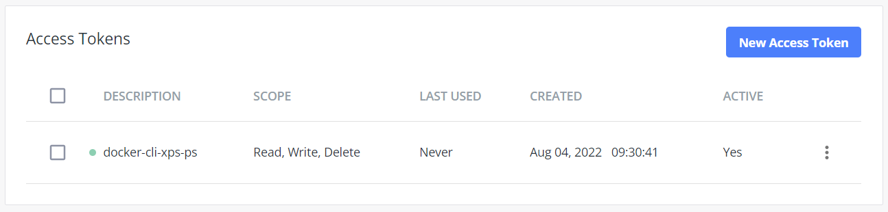
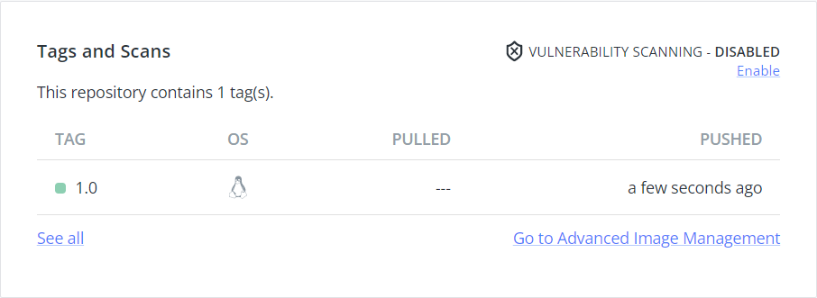
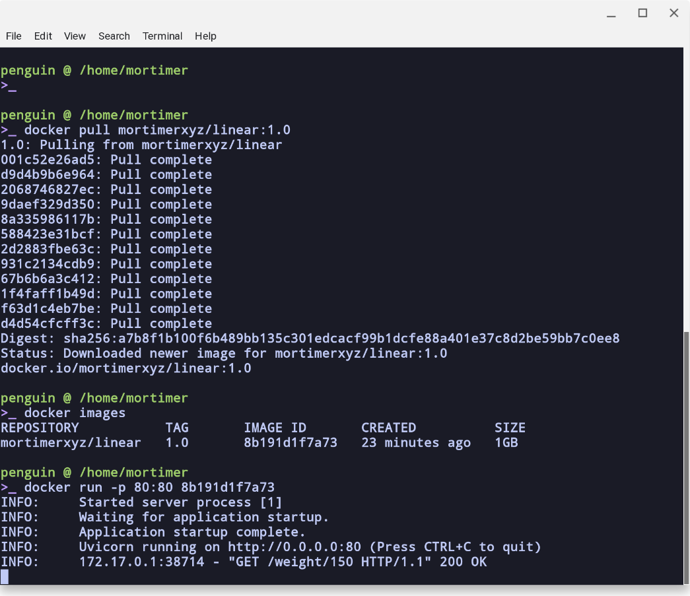

# Basic example of a predictive model

## To demonstrate model scoring hosted as API

The reason for doing this is to create a very light weight and infrastructure free way to demonstrate calling a model inference API from a web front end. It doesn't have many things you would potentially need for a real-life situation like:

- authentication
- authorization
- auto scaling

It is not meant to be used for production, but simply to demonstrate the mechanics.

### The model

First, we need a simple example of a _model_. We will use linear regression to model the relationship between height and weight.

A small sample of heights and weights was used.


The model in this case is a combination of the model function:

_weight_(_height_) = **m** _height_ + **b**

and the model parameters:

| parameter | value   |
| --------- | ------- |
| m         | 0.5772  |
| b         | -25.165 |

## Python

### Coded in a Python function

This model is very simply to code in Python. No need to for an ML model framework or a model registry for this demonstration.

```py
@app.get("/weight/{height}")
async def weight(height: int) -> dict:
    """
    This function takes a height and returns an estimated weight
        Args:
            height: user inputs the height
        Return:
            weight
        Model:
            y = mx + b
    """
    weight = 0.5772 * height - 25.165
    return {"weight": weight}
```

Now, how do we host this as a scoring/predicting/inference API

### Using Python and FastAPI

To get this up and running I will assume you have Python3 already. To get started you might want to create a new virtual environment and then install the dependencies:

```sh
pip install "fastapi[all]"
pip install uvicorn
```

The python script in this repo creates the REST end point.
To start it up use:

```sh
uvicorn model:app --reload
```

You'll see something like the below log if it is working and you can browse to the end point using [http://127.0.0.1:8000/weight/150](http://127.0.0.1:8000/weight/150) or for the Swagger docs using [http://127.0.0.1:8000/docs](http://127.0.0.1:8000/docs):

```log
INFO:     Will watch for changes in these directories: ['C:\\git\\fastapi']
INFO:     Uvicorn running on http://127.0.0.1:8000 (Press CTRL+C to quit)
INFO:     Started reloader process [36128] using watchgod
INFO:     Started server process [24032]
INFO:     Waiting for application startup.
INFO:     Application startup complete.
```


The part that does the "scoring" in the Python script is:

```py
weight = 0.5772*height - 25.165
return {"weight": weight}
```

## R

We will use Plumber.
I am on a brilliant Chromebook now which has a Debian distro on it. So, I needed these api packages to get it working:

```bash
sudo apt install libsodium-dev
sudo apt install libcurl4-openssl-dev
```

```R
install.packages("plumber")
```

### Coded in an R function

```R
#* Return the estimated weight
#* @param height the height
#* @get /weight
function(height) {
  0.5772 * as.numeric(height) - 25.165
}
```

### Using R and Plumber

Since I have added a shebang (`#!`) to the script and given it execute permissions (`chmod +x modelApi.R`) we can start the plumber web service like this:

```sh
./modelApi.R
```

You will get something like this in the log if it has worked:

```log
Running plumber API at http://127.0.0.1:8000
Running swagger Docs at http://127.0.0.1:8000/__docs__/
```


### Adding an interface and calling the API

A basic HTML front end has been created to demonstrate calling the API with user input.

In this example we are just using some JavaScript and Jquery to get the user input, pass it to the API and then populate the front end with the score.

To test it I am just using the [Live server](https://marketplace.visualstudio.com/items?itemName=ritwickdey.LiveServer) VScode extension. If you have cloned this repo you, and have the extension, you can just right click on the `index.html` and click on _Open with Live Server_.


The JavaScript that does the calling of the Python FastAPI is:

```js
var url = "http://127.0.0.1:8000/weight/" + height;
$.get(url, function (data) {
  console.log(data.weight);
  weight.value = data.weight;
});
```

If we want to test this for the R Plumber API we would just change it to:

```js
var url = "http://127.0.0.1:8000/weight?height=" + height;
$.get(url, function (data) {
  console.log(data.weight);
  weight.value = data.weight;
});
```

## Use Docker to host the Python FastAPI service

Now to host such a service we need a way to deploy this somewhere. We have lots of options. The first option that comes to mind would be to:

1. spin up a cloud Linux virtual machine
2. go through the process of installing Python and the packages required
3. run the uvicorn service in the background

However, let's go through the process of hosting it using Docker.

### Install Docker on your local computer

I'm using Windows now for this process, so I installed the Windows installer.

### Build the image

```ps1
docker build -t mortimerxyz/linear:1.0 .
```

#### Windows using PowerShell

The Windows build took significantly longer than the Linux one below.

```log
Sending build context to Docker daemon  3.322MB
Step 1/6 : FROM python:3.9
 ---> 05cae63731aa
Step 2/6 : WORKDIR /
 ---> Running in 1e478e292609
Removing intermediate container 1e478e292609
 ---> be030c7a42e0
Step 3/6 : COPY ./requirements.txt ./
 ---> 2487f2c14aec
Step 4/6 : RUN pip install --no-cache-dir --upgrade -r requirements.txt
 ---> Running in f8b71525170b
Collecting fastapi[all]
  Downloading fastapi-0.79.0-py3-none-any.whl (54 kB)
     ---------------------------------------- 54.6/54.6 KB 1.4 MB/s eta 0:00:00
Collecting uvicorn
  Downloading uvicorn-0.18.2-py3-none-any.whl (57 kB)
     ---------------------------------------- 57.0/57.0 KB ? eta 0:00:00
[...]
Successfully installed [...]

 ---> b901eee1947f
Step 5/6 : COPY ./fastapiApp /app
 ---> b65d2074826b
Step 6/6 : CMD ["uvicorn", "app.model:app", "--host", "0.0.0.0", "--port", "80"]
 ---> Running in 8f20e0e45191
Removing intermediate container 8f20e0e45191
 ---> 24ba8c92979c
Successfully built 24ba8c92979c
Successfully tagged mortimerxyz/linear:1.0

Use 'docker scan' to run Snyk tests against images to find vulnerabilities and learn how to fix them
```

#### WSL on bash

I'm going to push this one so I can then pull it on my Chromebook (Debian) and test using it.

```log
[+] Building 74.9s (10/10) FINISHED
 => [internal] load build definition from Dockerfile                     0.1s
 => => transferring dockerfile: 430B                                     0.0s
 => [internal] load .dockerignore                                        0.1s
 => => transferring context: 2B                                          0.0s
 => [internal] load metadata for docker.io/library/python:3.9           10.3s
 => [auth] library/python:pull token for registry-1.docker.io            0.0s
 => [1/5] FROM docker.io/library/python:3.9@sha256:[...]                51.3s
 => => resolve docker.io/library/python:3.9@sha256:[...]f                0.0s
 => => sha256: [...] 2.22kB / 2.22kB                                     0.0s
 => [internal] load build context                                        0.1s
 => => transferring context: 832B                                        0.1s
 => [2/5] COPY ./requirements.txt ./                                     0.6s
 => [3/5] RUN pip install --no-cache-dir --upgrade -r requirements.txt  11.8s
 => [4/5] COPY ./fastapiApp /app                                         0.0s
 => exporting to image                                                   0.6s
 => => exporting layers                                                  0.6s
 => => writing image sha256:[...]                                        0.0s
 => => naming to docker.io/mortimerxyz/linear:1.0                        0.0s

Use 'docker scan' to run Snyk tests against images to find vulnerabilities and learn how to fix them
```

### Test running it

```ps1
docker run -p 80:80 24ba8c92979c
```

```log
INFO:     Started server process [1324]
INFO:     Waiting for application startup.
INFO:     Application startup complete.
INFO:     Uvicorn running on http://0.0.0.0:80 (Press CTRL+C to quit)
INFO:     192.168.0.19:23413 - "GET /weight/150 HTTP/1.1" 200 OK
```

### Publish it

To follow this process, you don't need this step, but if you do, you will want to sign up for Docker Hub.

1. Sign up to Docker Hub
1. Create an access token



```ps1
docker login -u mortimerxyz
```

```ps1
docker push mortimerxyz/linear:1.0
```

```log
The push refers to repository [docker.io/mortimerxyz/linear]
849958a0eb7c: Preparing
a7b3e42a4b41: Pushed
c00d727af360: Pushed
27a391641a6d: Pushed
6bf06ec166f0: Pushed
b2809f3ef892: Pushed
1a31622a1cf9: Pushed
b588d5e23fdf: Pushed
f22fec08a08a: Pushed
69c9ca396f64: Pushed
b55de1dfa670: Pushed
91896eadc954: Pushed
8b5e3ef66306: Pushed
63a0eaed8845: Pushed
e673d0986f90: Pushed
5e610cf6f254: Skipped foreign layer
d6fdd6832d95: Skipped foreign layer
1.0: digest: sha256:[...] size: 4232
```



### Test it on another platform

Now we see the benefit of all of this (hopefully). To get the whole thing running on another platform (another local machine or even a cloud VM) we can just to the following:

```bash
docker pull mortimerxyz/liner:1.0
# run with the IMAGE ID or the REPOSITORY:TAG
docker run -p 80:80 mortimerxyz/liner:1.0
```



Success and testing calling it is all good!

```bash
curl localhost:80/weight/200
```

```json
{ "weight": 90.275 }
```
