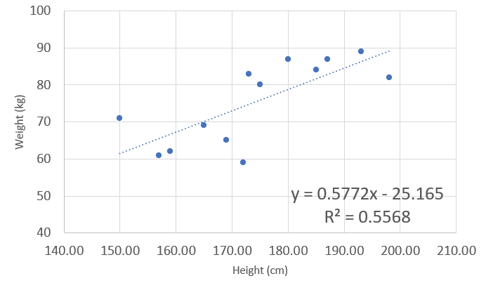
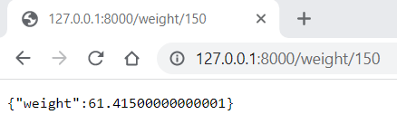
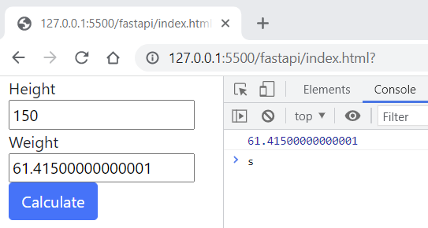

# Basic example of a predictive model

## To demonstrate model scoring hosted as API

### The model

First we need a simple example of a model. We will use linear regression to model the relationship between height and weight.

A small sample of heights and weights was used.


The model in this case is a combination of the model function:

_weight_(_height_) = **m** _height_ + **b**

and the model parameters:

| parameter | value   |
| --------- | ------- |
| m         | 0.5772  |
| b         | -25.165 |

How do we host this as a scoring API

### Using Python and FastAPI to create a scoring end point

Assume you have Python3 already, the dependencies are these:

```sh
pip install "fastapi[all]"
pip install uvicorn
```

The python script in this repo creates the REST end point.
To start it up use:

```sh
uvicorn model:app --reload
```

You'll see something like the below log if it is working and you can browse to the end point using [http://127.0.0.1:8000/weight/150](http://127.0.0.1:8000/weight/150) or for the Swagger docs using [http://127.0.0.1:8000/docs](http://127.0.0.1:8000/docs):

```log
INFO:     Will watch for changes in these directories: ['C:\\git\\fastapi']
INFO:     Uvicorn running on http://127.0.0.1:8000 (Press CTRL+C to quit)
INFO:     Started reloader process [36128] using watchgod
INFO:     Started server process [24032]
INFO:     Waiting for application startup.
INFO:     Application startup complete.
```



The part that does the "scoring" in the Python script is:

```py
weight = 0.5772*height - 25.165
return {"weight": weight}
```

### Adding an interface and calling the API

A basic HTML front end has been created to demonstrate calling the API with user input.

In this example we are just using some JS and Jquery to get the user input, pass it to the API and then populate the front end with the score.



The JS that does this is:

```js
var url = "http://127.0.0.1:8000/weight/" + height;
$.get(url, function (data) {
  console.log(data.weight);
  weight.value = data.weight;
});
```
