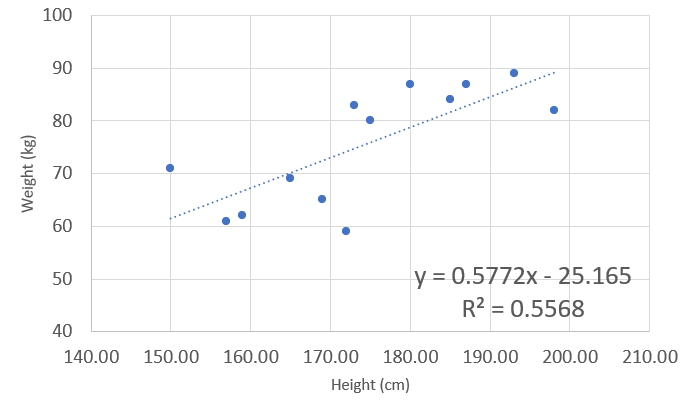
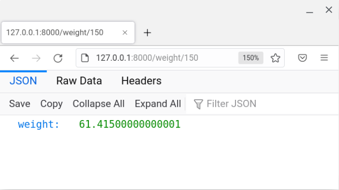
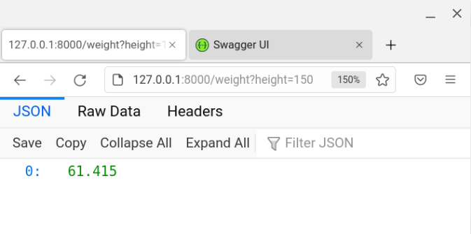
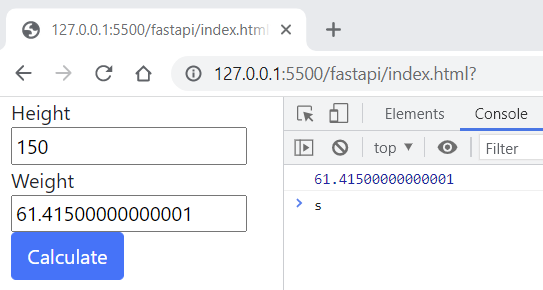

# Basic example of a predictive model

## To demonstrate model scoring hosted as API

The reason for doing this is to create a very light weight and infrastructure free way to demonstrate calling a model inference API from a web front end. It doesn't have many things you would potentially need for a real life situation like:

- authentication
- authorization
- auto scaling

It is not meant to be used for production, but simply to demonstrate the mechanics.

### The model

First we need a simple example of a _model_. We will use linear regression to model the relationship between height and weight.

A small sample of heights and weights was used.


The model in this case is a combination of the model function:

_weight_(_height_) = **m** _height_ + **b**

and the model parameters:

| parameter | value   |
| --------- | ------- |
| m         | 0.5772  |
| b         | -25.165 |

## Python
### Coded in a Python function

This model is very simply to code in Python. No need to for an ML model framework or a model registry for this demonstration.

```py
@app.get("/weight/{height}")
async def weight(height: int) -> dict:
    """
    This function takes a height and returns an estimated weight
        Args:
            height: user inputs the height
        Return:
            weight
        Model:
            y = mx + b
    """
    weight = 0.5772 * height - 25.165
    return {"weight": weight}
```

Now, how do we host this as a scoring/predicting/inference API

### Using Python and FastAPI

To get this up and running I will assume you have Python3 already. To get started you might want to create a new virtual environment and then install the dependencies:

```sh
pip install "fastapi[all]"
pip install uvicorn
```

The python script in this repo creates the REST end point.
To start it up use:

```sh
uvicorn model:app --reload
```

You'll see something like the below log if it is working and you can browse to the end point using [http://127.0.0.1:8000/weight/150](http://127.0.0.1:8000/weight/150) or for the Swagger docs using [http://127.0.0.1:8000/docs](http://127.0.0.1:8000/docs):

```log
INFO:     Will watch for changes in these directories: ['C:\\git\\fastapi']
INFO:     Uvicorn running on http://127.0.0.1:8000 (Press CTRL+C to quit)
INFO:     Started reloader process [36128] using watchgod
INFO:     Started server process [24032]
INFO:     Waiting for application startup.
INFO:     Application startup complete.
```



The part that does the "scoring" in the Python script is:

```py
weight = 0.5772*height - 25.165
return {"weight": weight}
```
## R

We will use Plumber.
I am on a brilliant Chromebook at the moment which has a Debian distro on it. So I need this to get going:

```bash
sudo apt install libsodium-dev
sudo apt install libcurl4-openssl-dev
```

```R
install.packages("plumber")
```

### Coded in an R function

```R
#* Return the estimated weight
#* @param height the height
#* @get /weight
function(height) {
  0.5772 * as.numeric(height) - 25.165
}
```

### Using R and Plumber

Since I have added a shebang (`#!`) to the script and given it execute permissions (`chmod +x modelApi.R`) we can start the plumber web service like this:

```sh
./modelApi.R
```

You will get something like this in the log if it has worked:

```log
Running plumber API at http://127.0.0.1:8000
Running swagger Docs at http://127.0.0.1:8000/__docs__/
```


### Adding an interface and calling the API

A basic HTML front end has been created to demonstrate calling the API with user input.

In this example we are just using some JavaScript and Jquery to get the user input, pass it to the API and then populate the front end with the score.

To test it I am just using the [Live server](https://marketplace.visualstudio.com/items?itemName=ritwickdey.LiveServer) VScode extension. If you have cloned this repo you, and have the extension, you can just right click on the `index.html` and click on _Open with Live Server_.



The JavaScript that does the calling of the Python FastAPI is:

```js
var url = "http://127.0.0.1:8000/weight/" + height;
$.get(url, function (data) {
  console.log(data.weight);
  weight.value = data.weight;
});
```

If we want to test this for the R Plumber API we would just change it to:

```js
var url = "http://127.0.0.1:8000/weight?height=" + height;
$.get(url, function (data) {
  console.log(data.weight);
  weight.value = data.weight;
});
```